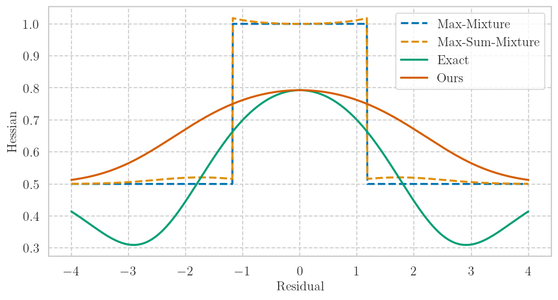

<!-- From https://github.com/othneildrew/Best-README-Template?tab=readme-ov-file -->
<a name="readme-top"></a>

<!-- [![Contributors][contributors-shield]][contributors-url] -->
<!-- [![Forks][forks-shield]][forks-url] -->
<!-- [![Stargazers][stars-shield]][stars-url] -->
[![MIT License][license-shield]][license-url]
[![Issues][issues-shield]][issues-url]
[![LinkedIn][linkedin-shield]][linkedin-url]


<!-- PROJECT LOGO -->
<br />
<div align="center">
  <a href="https://github.com/decargroup/hessian_sum_mixtures">
    
  </a>

<h3 align="center">Hessian Sum-Mixtures</h3>

  <p align="center">
    A nonlinear least squares Hessian for Gaussian Mixture Factors. 
    Our method explicitly uses the chain rule
    to take into account the LogSumExp nonlinearity proper to negative log-likelihoods of Gaussian Mixtures. 
    A method to maintain compatibility with standard nonlinear least-squares solvers is provided. This repository contains the companion code 
    and supplementary material for our submission to IEEE Robotics and Automation Letters titled "A Hessian for Gaussian Mixture Likelihoods in Nonlinear Least Squares".
  </p>
</div>

## Getting Started
Install general requirements using
```
pip install -r requirements.txt
```
Install the navlie submodule, 
```
pip install -e ./navlie
```
Install the project library using 
```
pip install -e ./mixtures
```
Run tests using 
```
cd tests; pytest
```

This was developed in Python 3.10.1. A virtualenv is recommended. 
<!-- 
### Prerequisites

This is an example of how to list things you need to use the software and how to install them.
* npm
  ```sh
  npm install npm@latest -g
  ```

### Installation

1. Get a free API Key at [https://example.com](https://example.com)
2. Clone the repo
   ```sh
   git clone https://github.com/decargroup/hessian_sum_mixtures.git
   ```
3. Install NPM packages
   ```sh
   npm install
   ```
4. Enter your API in `config.js`
   ```js
   const API_KEY = 'ENTER YOUR API';
   ```

<p align="right">(<a href="#readme-top">back to top</a>)</p> -->

## Reproducing Results From Our Paper
Please run the corresponding bash script,
```
cd ./scripts/bash_scripts_paper_results
./run_all.sh
```

<!-- USAGE EXAMPLES -->
## Usage
The key functionality of this project is in the ```gaussian_mixtures.py``` file in the
```mixtures`` library. Errors corresponding to the components are provided to initialize 
the Gaussian Mixture factors, which then mix the component errors and Jacobians to provide
the final mixture error and jacobian. 
Supplementary material with jacobian derivations is provided in ```supplementary.pdf```. 

## License

Distributed under the MIT License. See `LICENSE.txt` for more information. -->

## Contact

Vassili Korotkine - [@decargroup](https://twitter.com/decargroup) - vassili.korotkine@mail.mcgill.ca

Project Link: [https://github.com/decargroup/hessian_sum_mixtures](https://github.com/decargroup/hessian_sum_mixtures)
<!-- <p align="right">(<a href="#readme-top">back to top</a>)</p> -->
<!-- ACKNOWLEDGMENTS -->

## Acknowledgments

* The project is built on top of the [navlie library for on-manifold state estimation.](https://github.com/decargroup/navlie)
* The project is funded via the Natural Sciences and Engineering Research Council of Canada (NSERC) Alliance Grant in collaboration with Denso Corporation.
<p align="right">(<a href="#readme-top">back to top</a>)</p>

<!-- MARKDOWN LINKS & IMAGES -->
<!-- https://www.markdownguide.org/basic-syntax/#reference-style-links -->
<!-- [contributors-shield]: https://img.shields.io/github/contributors/decargroup/hessian_sum_mixtures.svg?style=for-the-badge -->
<!-- [contributors-url]: https://github.com/decargroup/hessian_sum_mixtures/graphs/contributors -->
<!-- [forks-shield]: https://img.shields.io/github/forks/decargroup/hessian_sum_mixtures.svg?style=for-the-badge -->
<!-- [forks-url]: https://github.com/decargroup/hessian_sum_mixtures/network/members -->
<!-- [stars-shield]: https://img.shields.io/github/stars/decargroup/hessian_sum_mixtures.svg?style=for-the-badge -->
<!-- [stars-url]: https://github.com/decargroup/hessian_sum_mixtures/stargazers -->
[issues-shield]: https://img.shields.io/github/issues/decargroup/hessian_sum_mixtures.svg?style=for-the-badge
[issues-url]: https://github.com/decargroup/hessian_sum_mixtures/issues
[license-shield]: https://img.shields.io/github/license/decargroup/hessian_sum_mixtures.svg?style=for-the-badge
[license-url]: https://github.com/decargroup/hessian_sum_mixtures/blob/master/LICENSE
[linkedin-shield]: https://img.shields.io/badge/-LinkedIn-black.svg?style=for-the-badge&logo=linkedin&colorB=555
[linkedin-url]: https://ca.linkedin.com/company/decargroup
[product-screenshot]: images/screenshot.png
<!-- [Next.js]: https://img.shields.io/badge/next.js-000000?style=for-the-badge&logo=nextdotjs&logoColor=white -->
<!-- [Next-url]: https://nextjs.org/ -->
<!-- [React.js]: https://img.shields.io/badge/React-20232A?style=for-the-badge&logo=react&logoColor=61DAFB -->
<!-- [React-url]: https://reactjs.org/ -->
<!-- [Vue.js]: https://img.shields.io/badge/Vue.js-35495E?style=for-the-badge&logo=vuedotjs&logoColor=4FC08D -->
<!-- [Vue-url]: https://vuejs.org/ -->
<!-- [Angular.io]: https://img.shields.io/badge/Angular-DD0031?style=for-the-badge&logo=angular&logoColor=white -->
<!-- [Angular-url]: https://angular.io/ -->
<!-- [Svelte.dev]: https://img.shields.io/badge/Svelte-4A4A55?style=for-the-badge&logo=svelte&logoColor=FF3E00 -->
<!-- [Svelte-url]: https://svelte.dev/ -->
<!-- [Laravel.com]: https://img.shields.io/badge/Laravel-FF2D20?style=for-the-badge&logo=laravel&logoColor=white -->
<!-- [Laravel-url]: https://laravel.com -->
<!-- [Bootstrap.com]: https://img.shields.io/badge/Bootstrap-563D7C?style=for-the-badge&logo=bootstrap&logoColor=white -->
<!-- [Bootstrap-url]: https://getbootstrap.com -->
<!-- [JQuery.com]: https://img.shields.io/badge/jQuery-0769AD?style=for-the-badge&logo=jquery&logoColor=white -->
<!-- [JQuery-url]: https://jquery.com  -->
